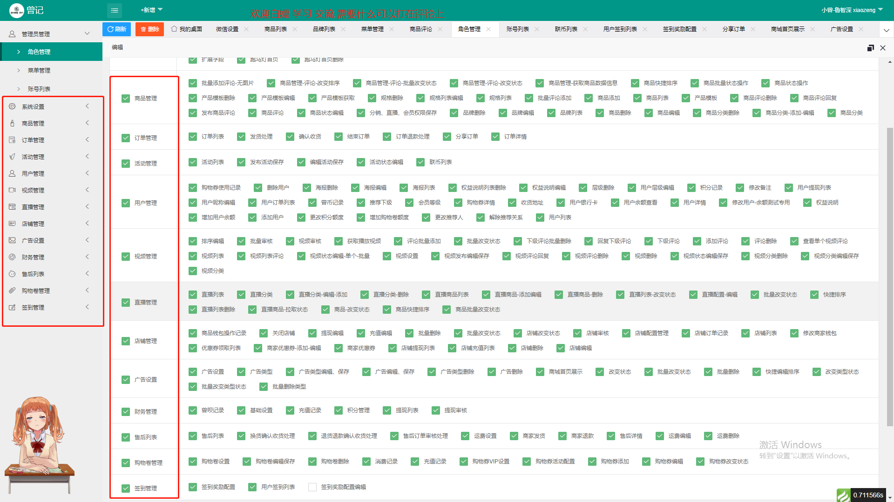
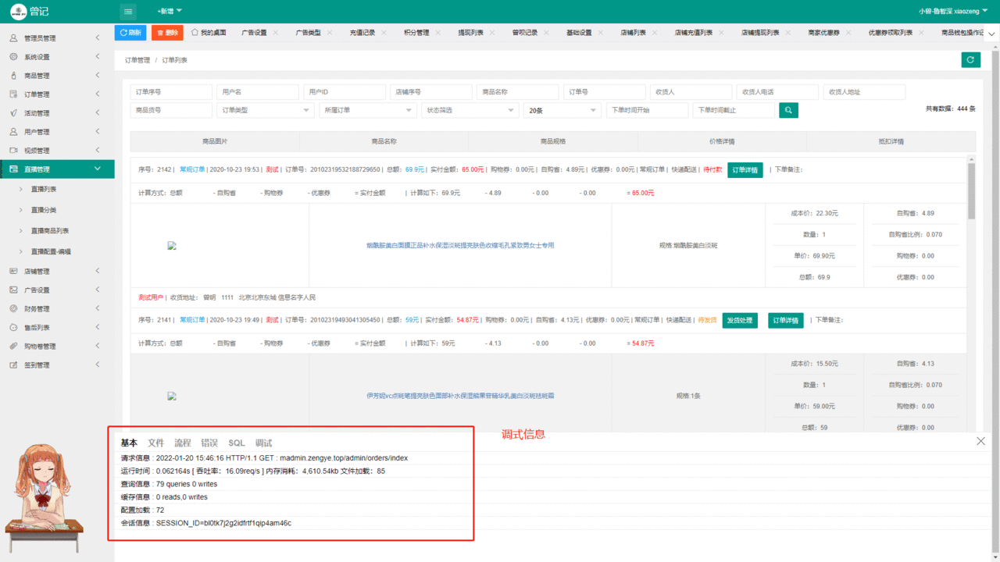
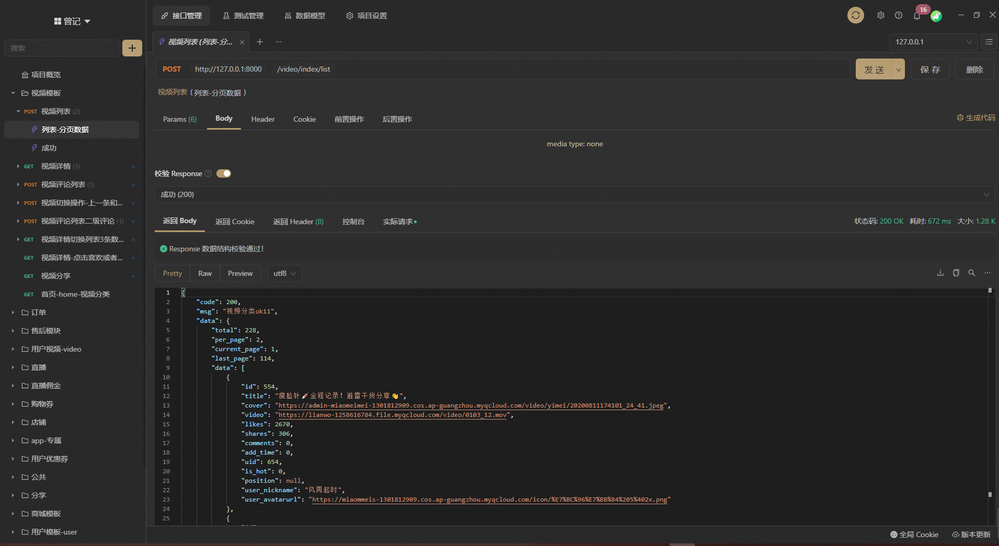

## 开源：Apache2开源协议发布，并提供免费使用。（免费白嫖，欢迎欢迎 ）

## 教程视频：[首页B站](https://space.bilibili.com/258238619) `https://space.bilibili.com/258238619`
  + [01-搭建项目视频教程](https://www.bilibili.com/video/BV18R4y1M7DJ)  `https://www.bilibili.com/video/BV18R4y1M7DJ`

## 一条龙服务项目 定位：社交+短视频+商城+sass系统 (来白嫖) 
  + [管理系统](https://gitee.com/user_ye/zeng_admin)：`https://gitee.com/user_ye/zeng_admin` **就是这个项目**
    + 演示站点：`https://madmin.zengye.top/admin/login` 账号：`admin` 密码：`123456`
  + [门店商户管理系统](): 待补充 预计这两天
  + [api接口-app小程序专用](https://gitee.com/user_ye/zeng_api): `https://gitee.com/user_ye/zeng_api`
  + [小程序代码](): 待补充 预计这两天

## 后台管理系统展示图：
  + 演示地址：[管理后台系统](https://madmin.zengye.top/admin/login) （里面的数据 随意操作）
  + 演示站点域名：`https://madmin.zengye.top/admin/login`
  + 因为域名走了cdn和并且添加了防盗链 直接从码云跳转过去可能会访问不了，建议复制链接直接新开游览器窗口打开
  + 账号：`xiaozeng` 密码：`123465`
  + ;
  + 
  + api接口项目演示图： （如需了解更多 请查看上面的git项目地址）
    + 
    + [api接口文档html](https://madmin.zengye.top/static/docs/zengji.html) 


## 为什么开源？（希望中国能向西方工会学习，受了某些‘良心’老板的欠薪，严重刨削，敢于站出来维护打工人的利益，前人种树，后人乘凉）
  + 公司名称：`喵美美（广州）网络科技有限公司` 于2020年10月低 欠薪跑路 [企业查链接](https://www.tianyancha.com/brand/b306e612764)
  + 宋林青 （已被劳动仲裁，列为失信人） 我们员工等11人 通过法院 法院要求宋林青执行支付工资 ，但宋林青不执行 （法院只能将其列为失信人员，我们员工等11人没有任何的赔偿和保障）
  + 宋林青 于2021-07月多创建了 `广东宝诗龙公司` 广州白云区 （没有查到法人和股东的信息） 听闻在里面
  + 在中国 老板欠薪跑路 我们普通员工 就算打赢了官司（劳动仲裁赢了）还是一分钱都拿不到 也没有任何保障
  + 为什么拖到现在开源，反抗 （我本是一个老实人，想着如何做好自己的本职工作，受点欺负，受点气也忍了 后面越忍  老板，领导就越往里面整）希望受到不公平的事情勇于反抗 （前人种树后人乘凉 反抗多了 资本家，老板就不会理所当然理直气壮 对比下西方的工会就知道 中国的打工有多不公平）
  + 晚点会打码上传法院裁决书和信息

## 仲裁证据（是一位小姐姐同事帮忙拍照的,姓名打码尊重同事的隐私）
  + 

## 欢迎白嫖 欢迎交流 联系方式如下：（主微信，qq很少上）
  + 微信：`zeng1569838235` 
  + qq: `1459584248`
  
### 如果觉得项目不错 ，麻烦动动你的小手指 花费一毛钱的短信 催 `宋林青 号码：13922314913` 发送：
  + `请尽快结清广州喵美美所欠员工的薪资`  
  + 只要发送了 有任何搭建或二开问题 我第一时间回复  亲力亲为帮你搭建好环境 项目

## 项目搭建  这里是后台管理系统 还有小程序api项目(tp6) 小程序代码等 待开源和补充文档完善
  + php版本：`5.4-7.2` 超过7.2版本某些功能和函数会报错 建议7.2版本
  + 需要安装redis，并启动
  + 创建数据库
  + 执行最新版的sql文件：[zeng.sql](./sql_back/zeng.sql)
  + 配置数据库，文件路径： `/application/database.php`
  + 配置域名运行目录为 `public`
  + 需要创建日志目录 `runtime` 记得给权限 0755
  + 需要创建图片上传文件夹 `public/newUploads` 记得给权限 0755
  + 需要创建临时存储的图片上传文件夹 `public/uploads/video_img` 记得给权限 0755
  + 需要配置伪静态：此处为nginx
  + 登录： 账号：`xiaozeng` 密码：`123456`

### 配置文件 （里面有写很详细的配置注释说明） 
  + 需要将 `env.ini.example` 复制一份到 `.env` 文件
  + 自行修改mysql 和 redis cos 等
   
```nginx
location / {
	if (!-e $request_filename){
		rewrite  ^(.*)$  /index.php?s=$1  last;   break;
	}
}
```

  + 登录页面：`/admin/login`

ThinkPHP 5.0
===============

[](https://packagist.org/packages/topthink/think)
[](https://packagist.org/packages/topthink/think)
[](https://packagist.org/packages/topthink/think)
[](https://packagist.org/packages/topthink/think)

ThinkPHP5在保持快速开发和大道至简的核心理念不变的同时，PHP版本要求提升到5.4，对已有的CBD模式做了更深的强化，优化核心，减少依赖，基于全新的架构思想和命名空间实现，是ThinkPHP突破原有框架思路的颠覆之作，其主要特性包括：

 + 基于命名空间和众多PHP新特性
 + 核心功能组件化
 + 强化路由功能
 + 更灵活的控制器
 + 重构的模型和数据库类
 + 配置文件可分离
 + 重写的自动验证和完成
 + 简化扩展机制
 + API支持完善
 + 改进的Log类
 + 命令行访问支持
 + REST支持
 + 引导文件支持
 + 方便的自动生成定义
 + 真正惰性加载
 + 分布式环境支持
 + 更多的社交类库

> ThinkPHP5的运行环境要求PHP5.4以上。

详细开发文档参考 [ThinkPHP5完全开发手册](http://www.kancloud.cn/manual/thinkphp5)

## 目录结构

初始的目录结构如下：

~~~
www  WEB部署目录（或者子目录）
├─application           应用目录
│  ├─common             公共模块目录（可以更改）
│  ├─module_name        模块目录
│  │  ├─config.php      模块配置文件
│  │  ├─common.php      模块函数文件
│  │  ├─controller      控制器目录
│  │  ├─model           模型目录
│  │  ├─view            视图目录
│  │  └─ ...            更多类库目录
│  │
│  ├─command.php        命令行工具配置文件
│  ├─common.php         公共函数文件
│  ├─config.php         公共配置文件
│  ├─route.php          路由配置文件
│  ├─tags.php           应用行为扩展定义文件
│  └─database.php       数据库配置文件
│
├─public                WEB目录（对外访问目录）
│  ├─index.php          入口文件
│  ├─router.php         快速测试文件
│  └─.htaccess          用于apache的重写
│
├─thinkphp              框架系统目录
│  ├─lang               语言文件目录
│  ├─library            框架类库目录
│  │  ├─think           Think类库包目录
│  │  └─traits          系统Trait目录
│  │
│  ├─tpl                系统模板目录
│  ├─base.php           基础定义文件
│  ├─console.php        控制台入口文件
│  ├─convention.php     框架惯例配置文件
│  ├─helper.php         助手函数文件
│  ├─phpunit.xml        phpunit配置文件
│  └─start.php          框架入口文件
│
├─extend                扩展类库目录
├─runtime               应用的运行时目录（可写，可定制）
├─vendor                第三方类库目录（Composer依赖库）
├─build.php             自动生成定义文件（参考）
├─composer.json         composer 定义文件
├─LICENSE.txt           授权说明文件
├─README.md             README 文件
├─think                 命令行入口文件
~~~

> router.php用于php自带webserver支持，可用于快速测试
> 切换到public目录后，启动命令：php -S localhost:8888  router.php
> 上面的目录结构和名称是可以改变的，这取决于你的入口文件和配置参数。

## 命名规范

`ThinkPHP5`遵循PSR-2命名规范和PSR-4自动加载规范，并且注意如下规范：

### 目录和文件

*   目录不强制规范，驼峰和小写+下划线模式均支持；
*   类库、函数文件统一以`.php`为后缀；
*   类的文件名均以命名空间定义，并且命名空间的路径和类库文件所在路径一致；
*   类名和类文件名保持一致，统一采用驼峰法命名（首字母大写）；

### 函数和类、属性命名

*   类的命名采用驼峰法，并且首字母大写，例如 `User`、`UserType`，默认不需要添加后缀，例如`UserController`应该直接命名为`User`；
*   函数的命名使用小写字母和下划线（小写字母开头）的方式，例如 `get_client_ip`；
*   方法的命名使用驼峰法，并且首字母小写，例如 `getUserName`；
*   属性的命名使用驼峰法，并且首字母小写，例如 `tableName`、`instance`；
*   以双下划线“__”打头的函数或方法作为魔法方法，例如 `__call` 和 `__autoload`；

### 常量和配置

*   常量以大写字母和下划线命名，例如 `APP_PATH`和 `THINK_PATH`；
*   配置参数以小写字母和下划线命名，例如 `url_route_on` 和`url_convert`；

### 数据表和字段

*   数据表和字段采用小写加下划线方式命名，并注意字段名不要以下划线开头，例如 `think_user` 表和 `user_name`字段，不建议使用驼峰和中文作为数据表字段命名。

## 参与开发

请参阅 [ThinkPHP5 核心框架包](https://github.com/top-think/framework)。

## 版权信息

ThinkPHP遵循Apache2开源协议发布，并提供免费使用。

本项目包含的第三方源码和二进制文件之版权信息另行标注。

版权所有Copyright © 2006-2018 by ThinkPHP (http://thinkphp.cn)

All rights reserved。

ThinkPHP® 商标和著作权所有者为上海顶想信息科技有限公司。

更多细节参阅 [LICENSE.txt](LICENSE.txt)
